<<<<<<< HEAD
# SmartNorte (frontend)

Una aplicación móvil que permite la interacción con agentes basados en un modelo de lenguaje de gran tamaño (Large Language Model).

## Descripción General

SmartNorte (Front) es una aplicación móvil desarrollada con React Native y Expo Go. Permite a los usuarios interactuar con agentes impulsados por un modelo de lenguaje avanzado, ofreciendo una experiencia conversacional de alta calidad. Además, integra la tecnología de Whisper para el reconocimiento de voz, facilitando la transcripción de audio a texto y permitiendo interacciones más naturales.

### Características Principales

- Interacción con agentes inteligentes: Comunícate con agentes basados en modelos de lenguaje de última generación para obtener respuestas y asistencia en tiempo real.
- Reconocimiento de voz con Whisper: Graba audio y convierte tu voz en texto utilizando la tecnología de Whisper, mejorando la accesibilidad y usabilidad.
- Interfaz de usuario intuitiva: Diseñada para ofrecer una experiencia fluida y amigable.
- Compatibilidad multiplataforma: Funciona en dispositivos iOS y Android gracias a React Native y Expo Go.

### Tecnologías Utilizadas

- React Native: Framework para el desarrollo de aplicaciones móviles nativas utilizando JavaScript y React.
- Expo Go: Plataforma que simplifica el desarrollo y prueba de aplicaciones React Native.
- OpenAI Whisper: Modelo de reconocimiento de voz para transcripción de audio a texto.

### Instalación

Sigue las instrucciones de instalación proporcionadas en el repositorio para configurar y ejecutar la aplicación en tu entorno local.

1. Clonar el repositorio:
```bash
git clone https://github.com/jorge-jrzz/maya_front.git
```

2. Instalar dependencias:
```bash
cd maya_front
npm install
```
3. Configurar variables de entorno:
- Crea un archivo .env en la raíz del proyecto.
- Agrega tus claves y configuraciones necesarias, como la clave de API de OpenAI.

4.	Iniciar la aplicación:
   ```bash
   npx expo prebuild --platform ios
   ```

   ```bash
   npx expo run:ios
   ```
=======
# React Native ChatGPT Clone with Clerk & RevenueCat

This is a React Native ChatGPT clone using [Clerk](https://go.clerk.com/wvMHe8T) for user authentication and [RevenueCat](https://www.revenuecat.com/docs/getting-started/installation/reactnative?utm_medium=sponsored&utm_source=youtube&utm_campaign=SimonGrimm) for In-App purchases.

Additional features:

- [Expo Router](https://docs.expo.dev/routing/introduction/) file-based navigation and API Routes
- [OpenAI API](https://platform.openai.com/) for GPT chat completions and image generation
- [Reanimated](https://docs.swmansion.com/react-native-reanimated/) 3 for animations
- [Gesture Handler](https://docs.swmansion.com/react-native-gesture-handler/) for gestures
- [Redash](https://github.com/wcandillon/react-native-redash) for animated text
- [Zeego](https://zeego.dev/start) for native menus
- [RN MMKV](https://github.com/mrousavy/react-native-mmkv) for efficient key/value storage
- [Expo SQLite](https://docs.expo.dev/versions/latest/sdk/sqlite-next/) for storing chats and messages
- [Bottom Sheet](https://ui.gorhom.dev/components/bottom-sheet/) for bottom sheet component
- [FlashList](https://shopify.github.io/flash-list/) for efficient list rendering
- [React Native OpenAI](https://github.com/candlefinance/react-native-openai) for streaming
- [Image Zoom](https://github.com/likashefqet/react-native-image-zoom) for image zoom component
- [Shimmer Placeholder](https://github.com/tomzaku/react-native-shimmer-placeholder) for loading placeholders

## Screenshots

<div style="display: flex; flex-direction: 'row';">
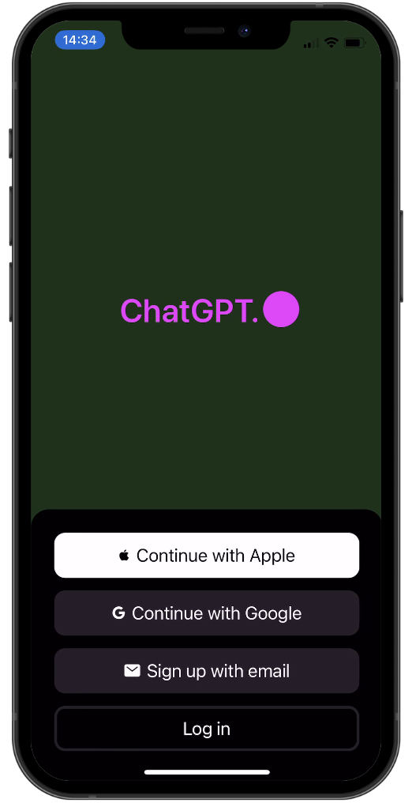
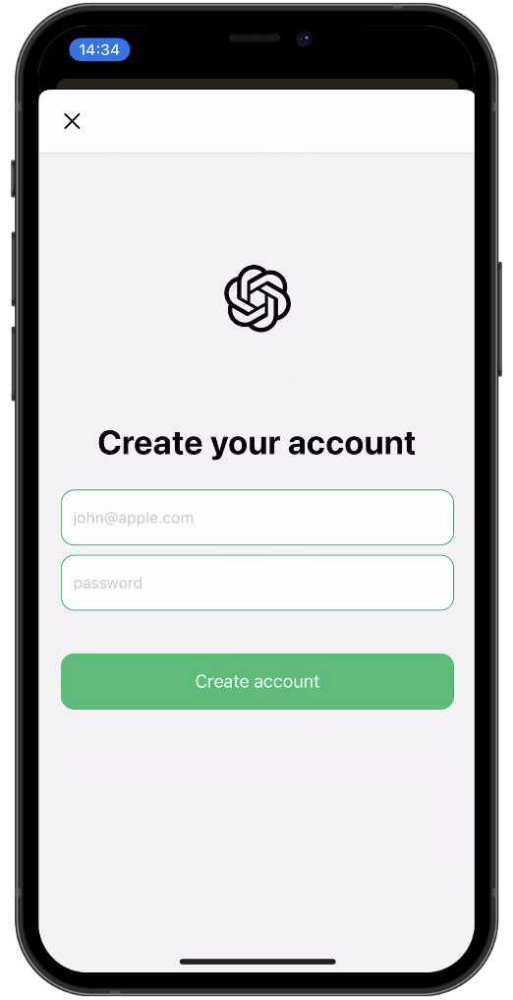
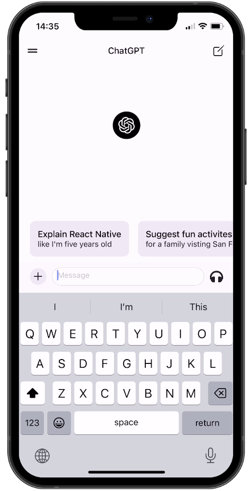
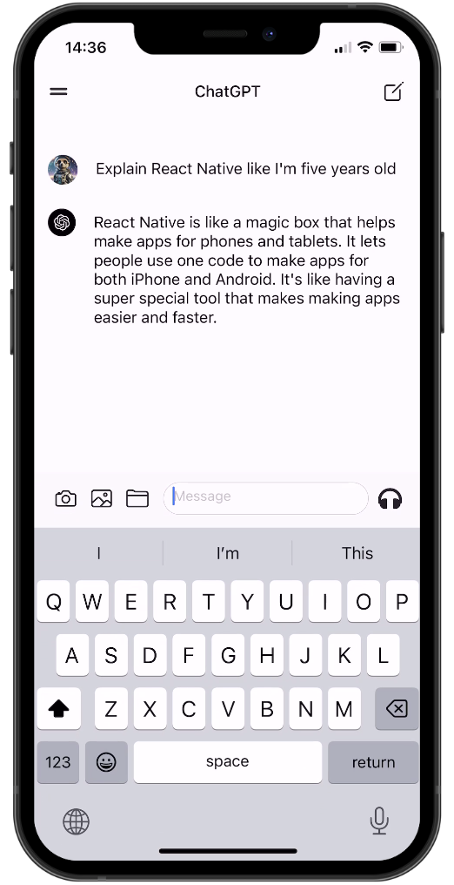
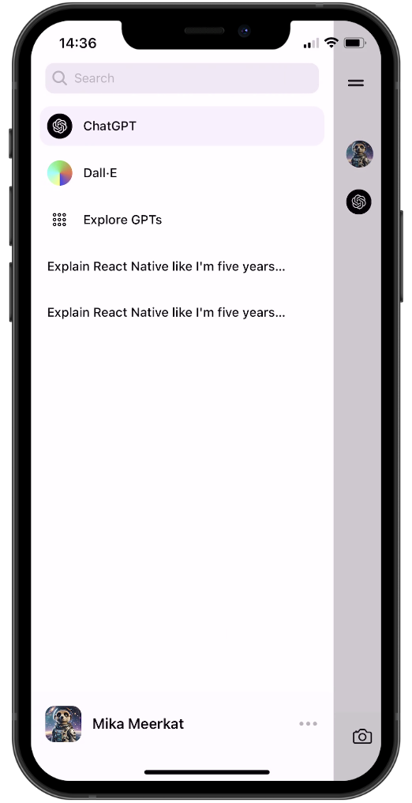
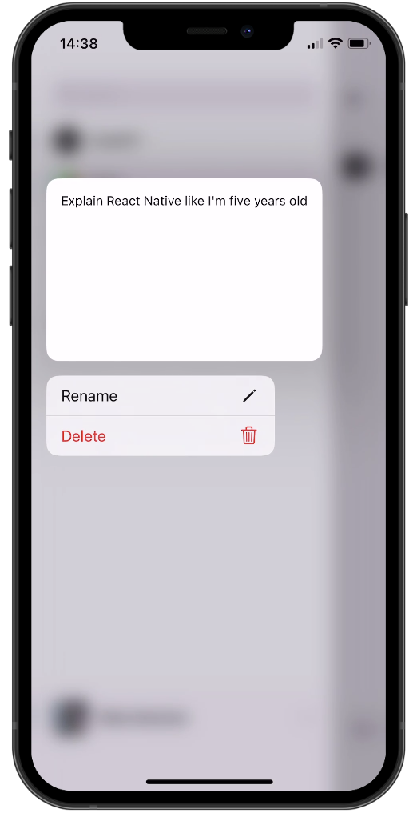
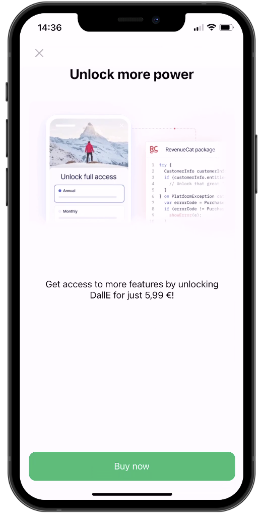
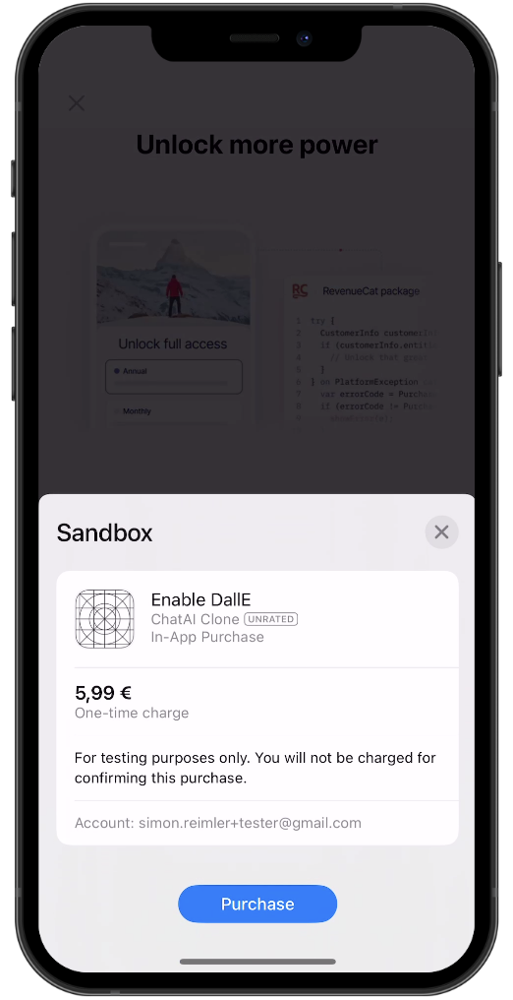
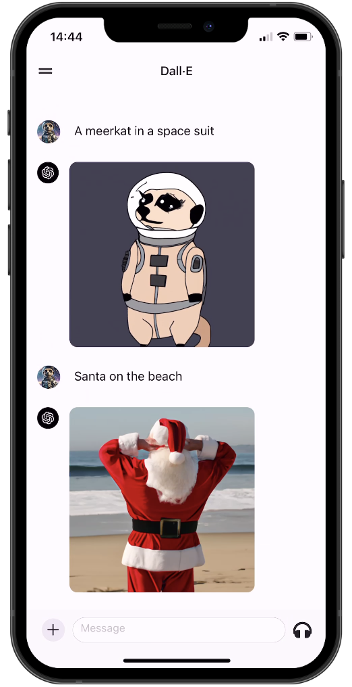
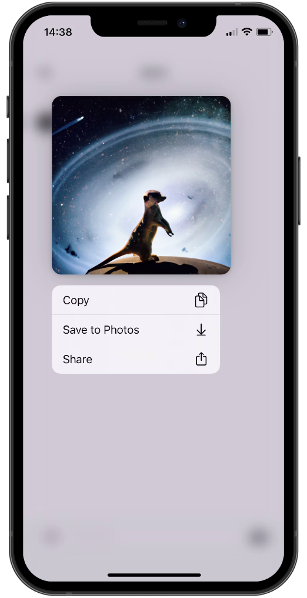
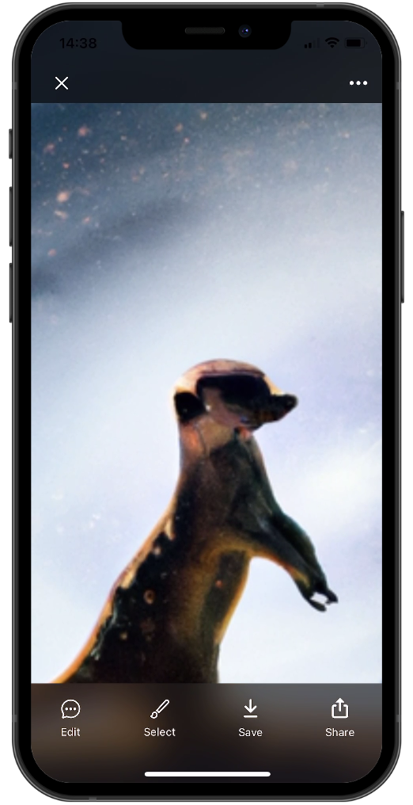
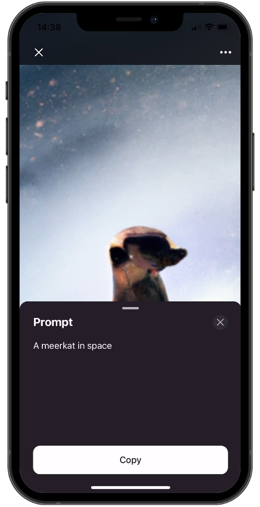
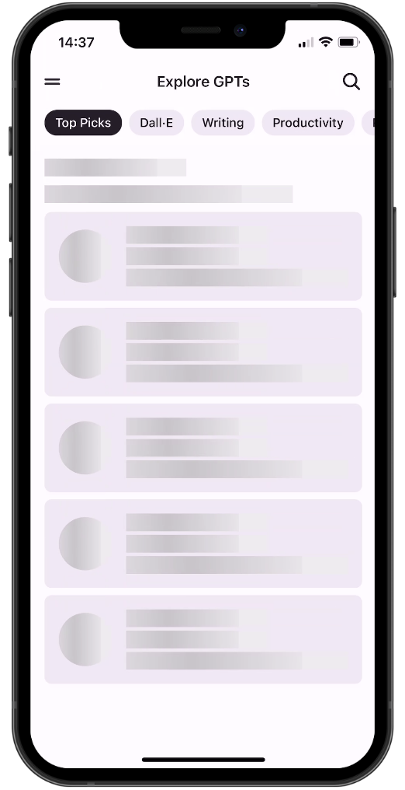
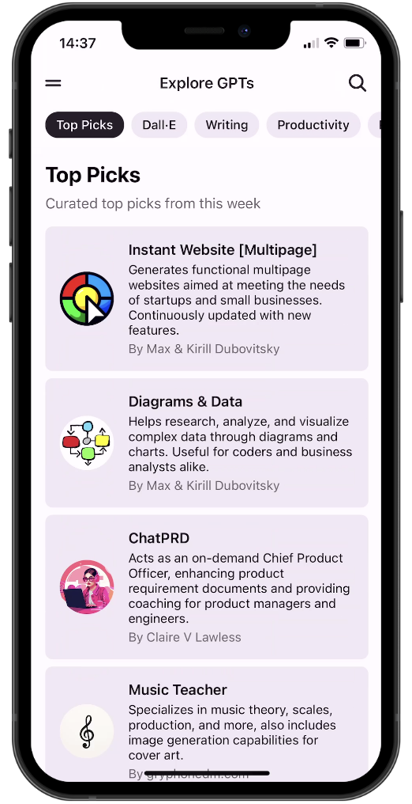
</div>

## Demo

<div style="display: flex; flex-direction: 'row';">
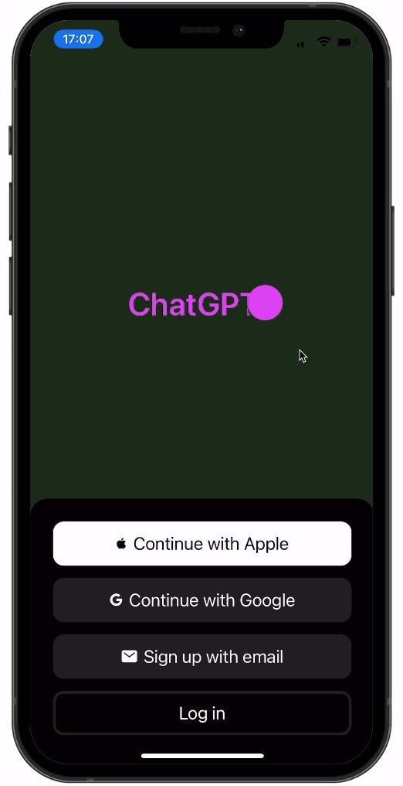
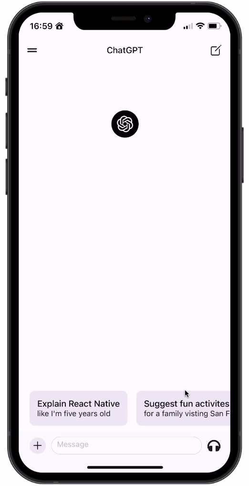
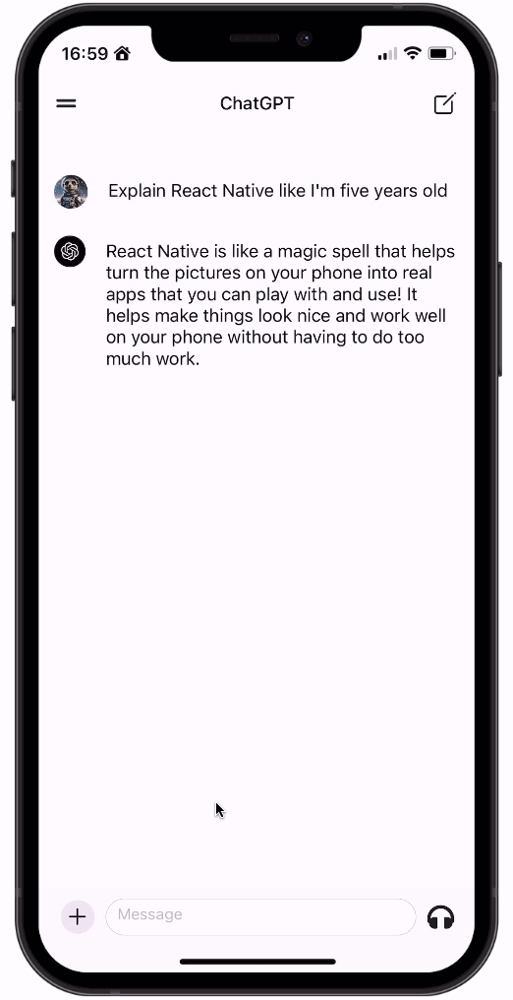

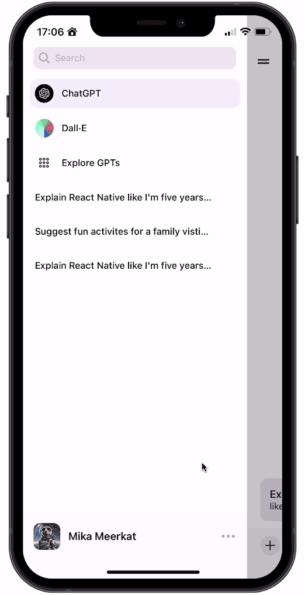


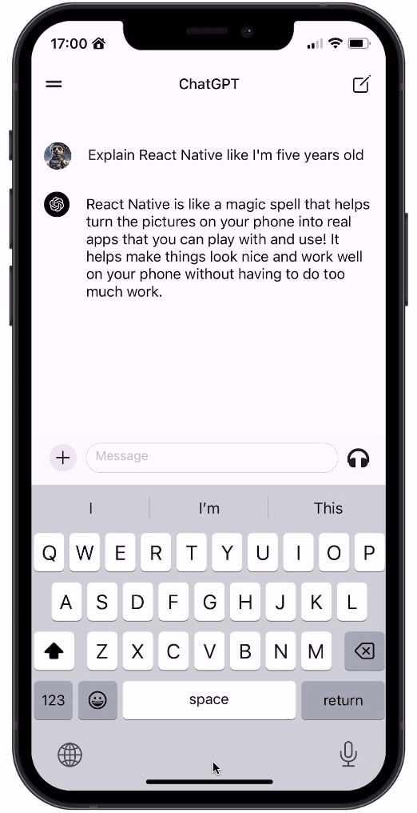
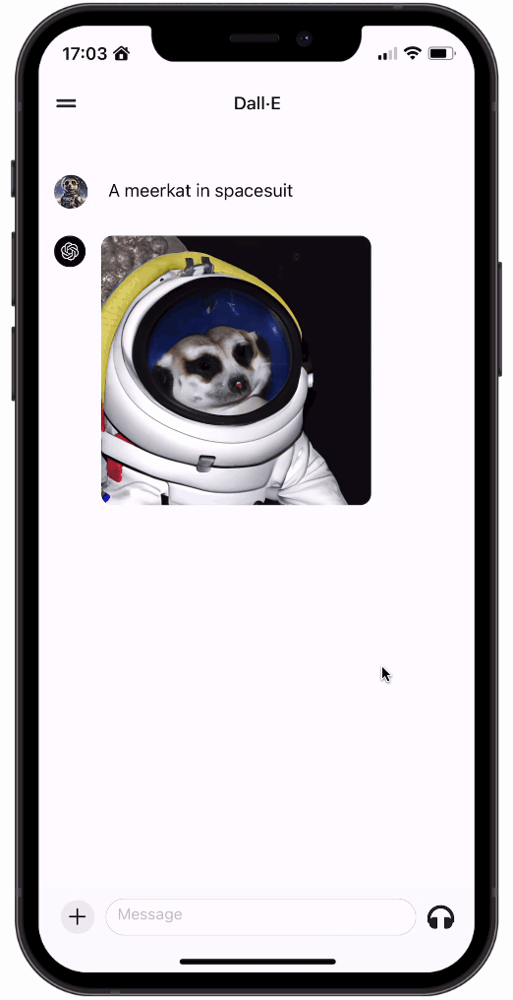


</div>

## 🚀 More

**Take a shortcut from web developer to mobile development fluency with guided learning**

Enjoyed this project? Learn to use React Native to build production-ready, native mobile apps for both iOS and Android based on your existing web development skills.

<a href="https://galaxies.dev"></a>
>>>>>>> fork/main
